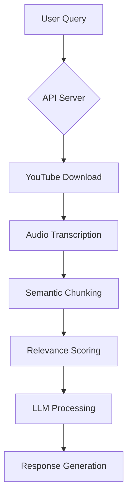

# Video-Chat: Intelligent Video Content Interaction Platform


A sophisticated AI-powered platform that enables natural language interaction with video content. Extract insights from YouTube videos through conversational AI powered by cutting-edge LLMs (Llama-3.2, Mistral-Nemo-Instruct).

## ✨ Key Features

- **Video Intelligence Engine**
  - YouTube audio extraction & automatic transcription
  - Temporal text chunking with semantic analysis
  - Context-aware similarity scoring (0-100 relevance metric)

- **Conversational AI Interface**
  - Asynchronous API endpoints for chat interactions
  - Conversation memory with token-aware buffering
  - Dual verification system for query relevance

- **Advanced LLM Integration**
  - Multi-model support (HuggingFace Endpoints)
  - Vision-enhanced instruction capabilities
  - Dynamic prompt templating with temperature control

## 🛠️ Tech Stack

**Core Components**
- Flask (REST API backend)
- Whisper (Speech-to-Text)
- yt-dlp (Media download)
- LangChain (LLM orchestration)

**AI Models**
- Meta Llama-3.2-3B-Instruct
- Mistral-Nemo-Instruct-2407
- HuggingFace Inference Endpoints

**Supporting Libraries**
- Whisper
- yt-dlp
- LangChain
- HuggingFace Hub

## 🚀 Installation

### Prerequisites
- Python 3.9+
- FFmpeg (`sudo apt-get install ffmpeg`)
- HuggingFace API token

### Setup
```bash
git clone https://github.com/yourusername/video-chat.git
cd video-chat

# Create virtual environment
python -m venv venv
source venv/bin/activate

# Install dependencies
pip install -r requirements.txt  # Create this file from imports
```

### Configuration
Create `.env` file:

```ini
HUGGINGFACEHUB_API_TOKEN=your_hf_token_here
PORT=10000
```

## 🛡️ API Usage

### Start Server
```bash
python app.py
```

### Endpoints

| Method | Endpoint      | Description               |
|--------|--------------|---------------------------|
| POST   | `/chat`      | Initiate chat session    |
| GET    | `/status/{id}` | Check processing status |

### Sample Request

```python
import requests

response = requests.post("http://localhost:10000/chat", json={
    "youtube_url": "https://youtu.be/example",
    "query": "Summarize key points from minutes 5-15"
})

task_id = response.json()["task_id"]
```

## 🧠 Architecture



## ⚠️ Limitations
- Requires GPU for optimal Whisper performance
- Limited to 4096 token context window
- YouTube age-restricted content may require cookies
- Currently supports English transcription only

## 🐟 License
MIT License - See LICENSE for details

> **Note:** This project requires HuggingFace API access for LLM operations. Ensure compliance with model providers' terms of service.
